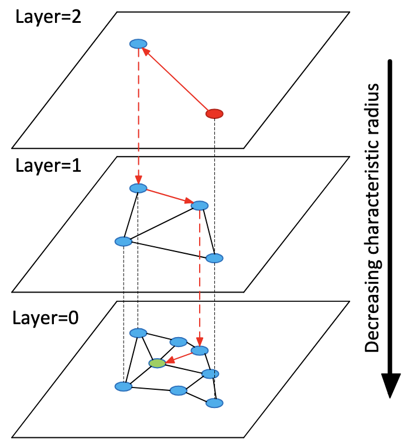
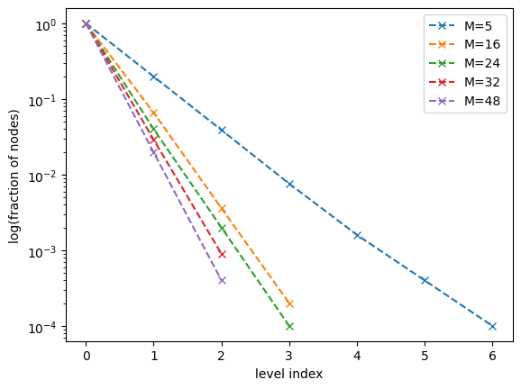

# rust-hnsw

## About

Implements Hierarchical Navigable Small World in rust, a state-of-the-art index used for approximate nearest neighbor 
search in vector databases.

The implementation is straightforward in the sense that it aims at following the original paper as much as possible, and 
while some care have been taken to make it performant, is not explicitly optimized for time or memory.

### Hierarchical Navigable Small World

It is a graph based index that aims at creating a "navigable" hierarchy of graphs to accelerate the search at runtime. 
More concretely, the index builds multiple graphs connecting vectors using a distance metric, and where the graph's density 
is decreasing the higher it is in the hierarchy. At the top level, the graph contains very few nodes while the base 
level contains a node for every vector indexed so far.



Once vectors are index, looking the nearest neighbors from a given query vector $q$ is an iterative process, where
the hierarchy is traveled from the top level to the base. From the top level, a random entry point is sampled and a 
greedy search on the graph is performed starting from it. The resulting nearest vector is used as entry point for the 
next level and the process continue until the base level is reached. Once in the base level, a regular greedy search 
return the k nearest neighbors.

The hierarchical structure of the index allows to traverse very large graphs rather quickly by 'hoping' large distances 
in the top levels to reach a more local neighborhood to look for the k nearest vectors of the query.

The 'navigability' of the index depends on two parameters:
- $m_L$, a normalization factor that defines the shape of the probability distribution used to sample the highest level a vector being indexed will be present in $l_{top} \sim \lfloor -log(\mathcal{U}(0,1)) \cdot m_L \rfloor$. In the original paper, authors suggest to set $m_L = \frac{1}{log M}$ where $M$ is the number of nearest neighbors to connect to a vector being inserted. Using this heuristic, the higher $M$, the stronger the exponential decay, meaning that the index will have fewer levels.



- $M_{max}$ and $M_{max0}$, that bound the number of neighbors a node can have in the higher levels and the base layer respectively. 

During index construction, a node can potentially be connected to a lot of neighbors depending on the value of $M$, so to limit the memory footprint, after connecting a new vector to its $M$ nearest neighbors in a given layer, edges of each neighbor are pruned to keep only $M_{max}$ nearest neighbors.

As per the paper, authors recommend setting $M_{max0} = 2M$ and $M_{max}$ to something a bit smaller.

The tradeoff between index build time and search quality is controlled by the parameter $ef_{construction}$ used during index construction: the higher it is, the lower the recall error. Authors suggest setting it to $\sim 100$.

## Getting Started

### Prerequisites

Install the standard rust toolchain `rustup` to get the compiler and the package manager:

```
curl --proto '=https' --tlsv1.2 -sSf https://sh.rustup.rs | sh
```

### Installing

Clone the repository:

```
git clone git@github.com:clabrugere/rust-hnsw.git
```

Cd within the crate and check that everything is fine:

```
cd rust-hnsw && cargo check
```

## Usage

The index is generic over the vector data type and its dimension. For example, to index 3 dimensional float 32 vectors, 
one would create the index this way:

```rust
use rand::rngs::SmallRng;
use rand::SeedableRng;
use rust_hnsw::distances::euclidean;
use rust_hnsw::hnsw::HNSW;

let rng = SmallRng::seed_from_u64(SEED);
let index: HNSW<f32, 3, _> = HNSW::new(16, 100, euclidean, rng);
```

and then add vectors one by one or from an iterator:

```rust
let v = [1.0, 2.0, 3.0];
index.insert(vector1);

let iterator: impl Iterator<Item = [f32; 3]> = ...
index.insert_batch(iterator);
```

_Note that the index doesn't take ownership of the vector but rather create and stores a copy internally. This is somewhat
arbitrary because we could take ownership instead without refactoring the architecture._

The `search` method return a vec containing references to the vectors found and their distances to the query wrapped 
in a small struct `SearchResult`, or an error if the index is empty. To search for nearest neighbors:

```rust
// return a Result<Vec<SearchResult<'_, T, D>>, &'static str> 
if let Ok(results) =  index.search(&vector, 1) {
    // do something
}
```

Finally, to remove every vectors and reset the index:

```rust
index.clear();
```

_Note that it resets the two main collections used internally to store the vectors and the sub graphs and so it will 
de-allocate the memory allocated by all the previous inserts instead of only deleting the elements and keeping the 
collections' previous capacity._

## Roadmap

- [x] base implementation of the index
- [x] unit tests of the index implementation
- [x] check if variable size collection initial sizes make sense
- [x] benchmark of index creation and search
- [ ] implement heuristic for `select_neighbors` method, as described in the paper
- [ ] use SIMD instructions for distance metrics
- [ ] parallelize vector insertion
- [ ] parallelize search

## References

```bibtex
@article{DBLP:journals/corr/MalkovY16,
  author       = {Yury A. Malkov and
                  Dmitry A. Yashunin},
  title        = {Efficient and robust approximate nearest neighbor search using Hierarchical
                  Navigable Small World graphs},
  journal      = {CoRR},
  volume       = {abs/1603.09320},
  year         = {2016},
  url          = {http://arxiv.org/abs/1603.09320},
  eprinttype    = {arXiv},
  eprint       = {1603.09320},
  timestamp    = {Thu, 26 Aug 2021 08:49:44 +0200},
  biburl       = {https://dblp.org/rec/journals/corr/MalkovY16.bib},
  bibsource    = {dblp computer science bibliography, https://dblp.org}
}
```
